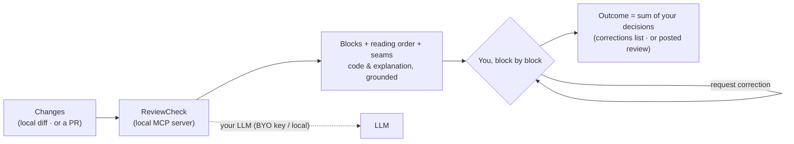
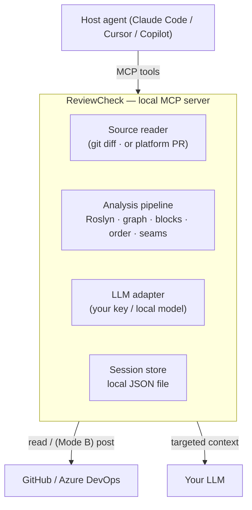

# ReviewCheck

**Guided, step-by-step code review that helps you actually understand the code an AI wrote for you — so you can own it, not just approve it.**


> As AI agents write a growing share of our code, the scarce resource is no longer *writing* — it's
> **human understanding that scales**. ReviewCheck breaks a change into **small, ordered blocks**,
> explains each one *next to the code it describes*, and walks you through them **one at a time** —
> so you finish a review having genuinely understood what you're about to ship, and **you** keep the
> decision. Designed first for developers with ADHD / attention differences; useful for everyone.

> [!IMPORTANT]
> **Project status: design complete, MVP execution planned — build not yet started.**
> This repo carries the **essential set** to build a professional MVP — the contracts, the four build
> plans, and the agent. The machine-readable contracts are in place; the MVP itself is not built yet.
> The **full product analysis** (problem, cognitive science, market, extended architecture, security,
> reading guide) lives in the [`ReviewCheckOLD`](https://github.com/Daisonoio/ReviewCheckOLD) repo —
> nothing was lost.
>
> **New here? Start with [`docs/README.md`](docs/README.md)** — the essential-docs index.

---

## Table of contents

- [The problem](#the-problem)
- [What ReviewCheck is](#what-reviewcheck-is)
- [How it works](#how-it-works)
- [Design principles (non-negotiable)](#design-principles-non-negotiable)
- [Architecture](#architecture)
- [Roadmap](#roadmap)
- [Repository structure](#repository-structure)
- [Getting started](#getting-started)
- [Contributing](#contributing)
- [Security & privacy](#security--privacy)
- [License](#license)

---

## The problem

Code review is where understanding should transfer and defects should be caught. In practice it's the
most-skipped step of the cycle — and AI-generated code makes it worse:

- Changes arrive **large and undifferentiated**: many files, no reading order, intent left implicit.
- The human brain can't hold that much new, interrelated information at once (working memory ≈ 4 chunks).
- So people **disengage** and approve with a defensive *"LGTM"* — precisely when the volume of code to
  review is exploding and the author often *asked for* the code rather than writing it line by line.

The result is a quiet erosion of **ownership**: nobody really understands, or feels responsible for,
the code that ships. For developers with **ADHD or attention differences**, this isn't friction — it's
a wall.

## What ReviewCheck is

A **local, open-source add-on** for AI coding environments (Claude Code, Cursor, Copilot, …), shipped
as an **agent definition (`.md`) + a local MCP server**. It takes a set of changes, splits it into
**coherent blocks**, and guides you through them:

- shows **code and explanation together**, with **line-level citations**;
- presents **one block at a time**, in a sensible **reading order**, with the **links** between blocks
  visible and the **seams** (where cross-block bugs hide) flagged;
- lets you **accept** or **request a correction** per block;
- produces the outcome as the **sum of your decisions** — the AI never gives a verdict.

**No backend. No database. No telemetry.** It runs on your machine, uses **your** LLM (your key or a
local model) and **your** repository access. Your code never leaves your infrastructure.

## How it works

Two sources, one engine:

- **Mode A — local diff, pre-PR (primary).** Review what an agent just wrote — the uncommitted /
  staged / local changes — **before** you open a pull request. Reads via `git`; **no token, no
  network**. The outcome is your understanding plus a **list of corrections to apply**.
- **Mode B — pull request (secondary).** Review a PR (yours or a teammate's); the outcome can be
  **posted** to GitHub / Azure DevOps (approve / request-changes, with a `comment_only` fallback when
  the platform forbids self-approval).



<details>
<summary>Example (inside Claude Code, Mode A)</summary>

```
You:  review the changes I just wrote, before I open the PR

Agent: [get_review_plan({type:"local"})]   ← reads git diff locally, no token/network
  Rate limiting for the public API. 6 blocks.
  Seam to check (from the graph): "allow() can return False → check every caller handles it".

  ── Block 1/6 ──  rate_limiter/limiter.py (new)
    class TokenBucket:
        def allow(self, key): ...
  WHAT: token-bucket limiter, the core of the change.        (cites limiter.py:1-11)
  WHY:  decides whether a request passes or is rejected.
  LINKS: used by the middleware (block 3), params from block 2.
  ⚠ Uncertainty: could not resolve `_refill` (defined elsewhere).
  Accept this block, or request a correction?

You:  what if key is null? request a correction
Agent: recorded. Next block?
  ...
  → Outcome: CORRECTIONS TO APPLY (nothing posted).
    • block 1: "handle key=null in allow()"
    Fix these, then open the PR.
```
</details>

## Design principles (non-negotiable)

These are enforced constraints, not preferences (see [`GUARDRAILS.md`](GUARDRAILS.md) for the
guaranteed-vs-instructed model):

| Principle | Meaning |
|---|---|
| **Co-presence** | Code and its explanation are always shown together. Never "explanation only". |
| **Grounding** | Every explanation cites specific lines; structural facts come from a deterministic graph, not the LLM; uncertainty is declared. **The code is the source of truth — the explanation is a guide.** |
| **Human-in-the-loop** | The AI explains and assists; it **never** judges or approves. The outcome is the sum of your per-block decisions + an explicit confirmation. |
| **Local by construction** | No backend, no database, no phone-home. Code goes only to *your* LLM. |
| **No dark patterns** | No streaks, no artificial urgency, no surveillance metrics. You control verbosity and pace. |

## Architecture

A local MCP server with a deterministic core and the LLM as a thin, grounded layer on top:



- **Deterministic backbone** (Roslyn parsing + semantic model, dependency graph, reading order, seams) does the
  reliable work; the **LLM only interprets** (intent labels + explanations) and its output is bound to
  citations. This keeps the tool robust and testable, and means the product never *depends* on the LLM
  being correct.
- Design contracts in [`docs/13`](docs/13-specification-build.md) and [`spec/`](spec/); the build plans run
  [`docs/22`](docs/22-mvp-execution-roadmap.md) → [`23`](docs/23-mcp-stub-first-plan.md) →
  [`24`](docs/24-pipeline-plan.md) → [`25`](docs/25-llm-plan.md).

## Roadmap

| Phase | Focus |
|---|---|
| **0 — Validation gate** | Minimal prototype + study with ADHD/ND users: does guided review improve comprehension *and* defect detection vs a raw diff? Go/no-go before building. |
| **1 — v1** | Local MCP add-on: Mode A (local diff), C# (Roslyn), BYO-key LLM, the full block-by-block flow; then Mode B (GitHub). |
| **2** | Standalone CLI, dedicated IDE extension, Azure DevOps / GitLab, rich visual concept map. |
| **3** | Recommended local models, per-repo codebase memory, personalization — all local. |

## Repository structure

```
docs/                 Contracts (13), MVP plans (22–25), agent plan (21), flow example (12), index (README).
spec/                 Machine-readable contracts: mcp-tools.json, session-state.schema.json
agent/                The product agent definition (reviewcheck.agent.md)
GUARDRAILS.md         Guardrails and how each is enforced
```

> This repo carries the **essential set** to build the MVP; the [`docs/README.md`](docs/README.md)
> index maps it out. The **full analysis** (problem, cognitive science, market, extended architecture,
> security) lives in the [`ReviewCheckOLD`](https://github.com/Daisonoio/ReviewCheckOLD) repo. The
> .NET solution (`src/`, `tests/`) is built from these plans starting at MVP-1 ([`docs/23`](docs/23-mcp-stub-first-plan.md)).

## Getting started

There's no runnable code yet. Where to look, depending on what you want:

1. **Find your way around** — [`docs/README.md`](docs/README.md), the essential-docs index.
2. **Understand the why** — the extended analysis (thesis, cognitive science, market, UX, security)
   lives in the [`ReviewCheckOLD`](https://github.com/Daisonoio/ReviewCheckOLD) repo.
3. **Build the MVP** — the execution roadmap [`docs/22`](docs/22-mvp-execution-roadmap.md) (technical
   gates only), then the three build plans in order:
   [MCP stub-first](docs/23-mcp-stub-first-plan.md) → [analysis pipeline](docs/24-pipeline-plan.md) →
   [grounded LLM](docs/25-llm-plan.md). The agent itself is specced in [`docs/21`](docs/21-development-plan.md).
4. **The contracts are the source of truth** — [`docs/13-specification-build.md`](docs/13-specification-build.md)
   and [`spec/`](spec/).

## Contributing

This is an early-stage, greenfield project — a good moment to shape it. Ways to help:

- **Implementation** — follow the MVP roadmap ([`docs/22`](docs/22-mvp-execution-roadmap.md)) starting
  with the stub-first MCP server ([`docs/23`](docs/23-mcp-stub-first-plan.md)).
- **Language support** — additional language analyzers beyond C# (Roslyn).
- **Evals** — rebuild the capability suite (grounding, no-verdict, co-presence, human-in-the-loop);
  deferred until after the MVP (see [`docs/22`](docs/22-mvp-execution-roadmap.md) §5).
- **Cognitive-accessibility research** — help design/run the Phase-0 study with neurodivergent
  developers (*"nothing about us without us"*).
- **Docs** — English translation of the design docs.

Please read [`GUARDRAILS.md`](GUARDRAILS.md) first: contributions that violate the non-negotiable
constraints (e.g. adding a backend, or an "auto-approve" capability) can't be accepted, by design.

## Security & privacy

ReviewCheck handles source code — the most sensitive asset a software team has — so security is a
first-class concern, not an afterthought. The local, no-backend model dissolves whole classes of SaaS
risk; the residual focus is **local token handling**, **supply-chain integrity** of the OSS package,
**no phone-home**, and **indirect prompt injection** via untrusted repo content. The full security
assessment lives in the [`ReviewCheckOLD`](https://github.com/Daisonoio/ReviewCheckOLD) repo.

## License

[MIT](LICENSE).

---

<sub>ReviewCheck is built on a simple conviction: when an agent writes the code, the AI should help you
**understand** it — not understand it **for you**. Understanding is how you keep ownership; the decision
— and the responsibility — stay yours.</sub>