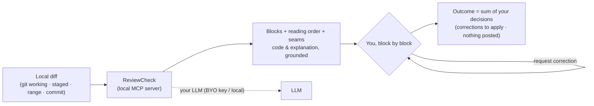
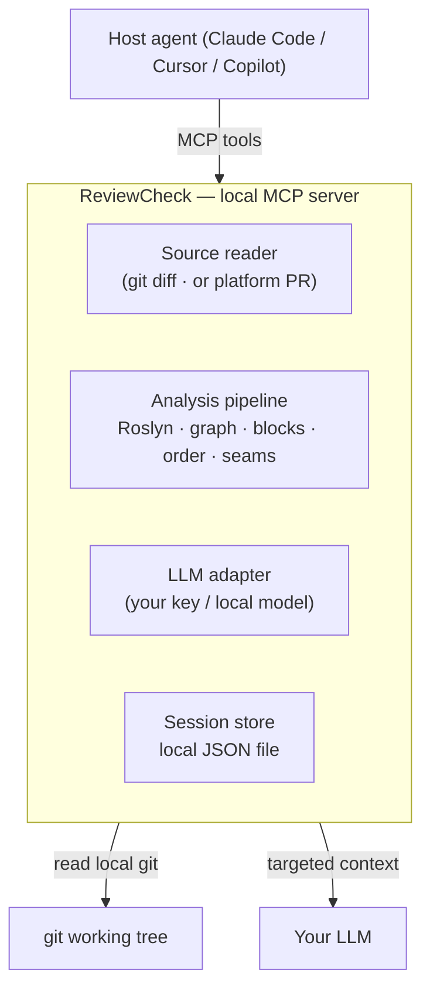

# ReviewCheck

**Guided, step-by-step code review that helps you actually understand the code an AI wrote for you — so you can own it, not just approve it.**


[](LICENSE)


> As AI agents write a growing share of our code, the scarce resource is no longer *writing* — it's
> **human understanding that scales**. ReviewCheck breaks a change into **small, ordered blocks**,
> explains each one *next to the code it describes*, and walks you through them **one at a time** —
> so you finish a review having genuinely understood what you're about to ship, and **you** keep the
> decision. Designed around a hypothesis about attention and working memory, with developers with ADHD in mind. Not yet validated with them — see the roadmap.

> [!IMPORTANT]
> **Project status: MVP built and working locally.** The full deterministic core (MVP-1 + MVP-2) and
> the grounded LLM narration layer (MVP-3) are implemented, covered by **180 passing tests**, and
> verified end-to-end inside Claude Code: a local `git diff` → a guided, block-by-block review →
> accept / request-correction → outcome. A GitHub pull request works the same way, ending in a real
> `approve` / `request_changes` / `comment_only` posted to the PR (never for a self-authored one — see
> [`GUARDRAILS.md`](GUARDRAILS.md) G10). C# (Roslyn) is the supported language. See
> [Getting started](#getting-started) to run it.
>
> **New here? Start with [`docs/README.md`](docs/README.md)** — the essential-docs index.

---

## Table of contents

- [The problem](#the-problem)
- [What ReviewCheck is](#what-reviewcheck-is)
- [How it works](#how-it-works)
- [Design principles (non-negotiable)](#design-principles-non-negotiable)
- [Architecture](#architecture)
- [Roadmap](#roadmap)
- [Repository structure](#repository-structure)
- [Getting started](#getting-started)
- [Contributing](#contributing)
- [Security & privacy](#security--privacy)
- [Changelog](#changelog)
- [License](#license)
- [Visual Studio (experimental)](#visual-studio-experimental)

---

## The problem

Code review is where understanding should transfer and defects should be caught. In practice it's the
most-skipped step of the cycle — and AI-generated code makes it worse:

- Changes arrive **large and undifferentiated**: many files, no reading order, intent left implicit.
- The human brain can't hold that much new, interrelated information at once (working memory ≈ 4 chunks).
- So people **disengage** and approve with a defensive *"LGTM"* — precisely when the volume of code to
  review is exploding and the author often *asked for* the code rather than writing it line by line.

The result is a quiet erosion of **ownership**: nobody really understands, or feels responsible for,
the code that ships. For developers with **ADHD or attention differences**, this isn't friction — it's
a wall.

## What ReviewCheck is

A **local, open-source add-on** for AI coding environments (Claude Code, Cursor, Copilot, …), shipped
as an **agent definition (`.md`) + a local MCP server**. It takes a set of changes, splits it into
**coherent blocks**, and guides you through them:

- shows **code and explanation together**, with **line-level citations**;
- presents **one block at a time**, in a sensible **reading order**, with the **links** between blocks
  visible and the **seams** (where cross-block bugs hide) flagged;
- lets you **accept** or **request a correction** per block;
- produces the outcome as the **sum of your decisions** — the AI never gives a verdict.

**No backend. No database. No telemetry.** It runs on your machine, uses **your** LLM (your key or a
local model) and **your** repository access. Your code never leaves your infrastructure.

## How it works

Review your **local diff** — the uncommitted / staged / local changes an agent (or you) just wrote,
**before** you open a pull request. Reads via `git`; **no token, no network**. The outcome is your
understanding plus a **list of corrections to apply** — nothing is ever posted.


```mermaid
flowchart LR
    A["Local diff<br/>(git working · staged · range · commit)"] --> P["ReviewCheck<br/>(local MCP server)"]
    P --> B["Blocks + reading order + seams<br/>code &amp; explanation, grounded"]
    B --> H{"You, block by block"}
    H -->|accept| H
    H -->|request correction| H
    H --> O["Outcome = sum of your decisions<br/>(corrections to apply · nothing posted)"]
    P -. "your LLM (BYO key / local)" .-> L["LLM"]
```

<details>
<summary>Example (inside Claude Code)</summary>

```
You:  review the changes I just wrote, before I open the PR

Agent: [get_review_plan({type:"local"})]   ← reads git diff locally, no token/network
  Discount pricing rules. 6 blocks across 5 files.
  Seam to check (from the graph): "Clamp() caps the percentage → check ApplyDiscount uses it".

  ── Block 2/6 ──  src/TestProject/PricingRules.cs (lines 8–9)
    public static int Clamp(int percent) =>
        percent < 0 ? 0 : percent > MaxDiscountPercent ? MaxDiscountPercent : percent;
  WHAT:  constrains a discount between 0 and MaxDiscountPercent.   (cites PricingRules.cs:8-9)
  WHY:   keeps every discount within the 50% cap defined in block 1.
  LINKS: uses 'MaxDiscountPercent' (block 1); used by 'ApplyDiscount' (block 3).
  Accept this block, or request a correction?

You:  what if percent is negative on the way in? request a correction
Agent: recorded. Next block?
  ...
  → Outcome: CORRECTIONS TO APPLY (nothing posted).
    • block 2: "double-check the negative-percent branch of Clamp"
    Fix these, then open the PR.
```
</details>

## Design principles (non-negotiable)

These are enforced constraints, not preferences (see [`GUARDRAILS.md`](GUARDRAILS.md) for the
guaranteed-vs-instructed model):

| Principle | Meaning |
|---|---|
| **Co-presence** | Code and its explanation are always shown together. Never "explanation only". |
| **Grounding** | Every explanation cites specific lines; structural facts come from a deterministic graph, not the LLM; uncertainty is declared. **The code is the source of truth — the explanation is a guide.** |
| **Human-in-the-loop** | The AI explains and assists; it **never** judges or approves. The outcome is the sum of your per-block decisions + an explicit confirmation. |
| **Local by construction** | No backend, no database, no phone-home. Code goes only to *your* LLM. |
| **No dark patterns** | No streaks, no artificial urgency, no surveillance metrics. You control verbosity and pace. |
| **Oversight signals, on request** | `review_health` reports grounding coverage, evaluative-language hits, and the correction/acceptance ratio for the session — shown only when asked, never a verdict on the reviewer. |

## Architecture

A local MCP server with a deterministic core and the LLM as a thin, grounded layer on top:


```mermaid
flowchart TB
    Host["Host agent (Claude Code / Cursor / Copilot)"] -->|MCP tools| RC
    subgraph RC["ReviewCheck — local MCP server"]
        SR["Source reader<br/>(git diff · or platform PR)"]
        PL["Analysis pipeline<br/>Roslyn · graph · blocks · order · seams"]
        LA["LLM adapter<br/>(your key / local model)"]
        SS["Session store<br/>local JSON file"]
    end
    RC -->|"read local git"| GH["git working tree"]
    RC -->|"targeted context"| LLM["Your LLM"]
```

- **Deterministic backbone** (Roslyn parsing + semantic model, dependency graph, reading order, seams) does the
  reliable work; the **LLM only interprets** (intent labels + explanations) and its output is bound to
  citations. This keeps the tool robust and testable, and means the product never *depends* on the LLM
  being correct.
- Design contracts in [`docs/13`](docs/13-specification-build.md) and [`spec/`](spec/); the build plans run
  [`docs/22`](docs/22-mvp-execution-roadmap.md) → [`23`](docs/23-mcp-stub-first-plan.md) →
  [`24`](docs/24-pipeline-plan.md) → [`25`](docs/25-llm-plan.md).

## Roadmap

| Phase | Focus | Status |
|---|---|---|
| **1 — v1 (MVP)** | Local MCP add-on: local-diff review, C# (Roslyn), BYO-key LLM, the full block-by-block flow, GitHub pull request review (read + post). | ✅ **Built** — local-diff pipeline (Roslyn), grounded LLM, 9 MCP tools, session persistence, recovery commands, GitHub PR read/list/post with the no-self-approval gate (GUARDRAILS G10). |
| **2** | Standalone CLI, dedicated IDE extension, Azure DevOps / GitLab, rich visual concept map. | ⬜ Planned |
| **3** | Recommended local models, per-repo codebase memory, personalization — all local. | ⬜ Planned |
| **Ongoing** | Validation study with ADHD/ND users: does guided review improve comprehension *and* defect detection vs a raw diff? | ⬜ Planned |

## Repository structure

```
src/                  The .NET solution (net8.0):
  ReviewCheck.Core        Immutable domain types + BlockGuard (co-presence + grounding)
  ReviewCheck.Platform    Unified-diff parser + LocalDiffReader (git, local process)
  ReviewCheck.Pipeline    Roslyn analysis P1–P8: graph, blocks, order, citations, seams
  ReviewCheck.Llm         ILlmProvider (BYO key) + LlmAdapter + rubric + FactsNarrator floor
  ReviewCheck.Session     Session persistence (local JSON under .reviewcheck/)
  ReviewCheck.Mcp         The MCP server: the 9 tools + narrator wiring
tests/                One xUnit project per src project (180 tests)
docs/                 Contracts (13), MVP plans (22–25), agent plan (21), flow example (12), index (README).
spec/                 Machine-readable contracts: mcp-tools.json, session-state.schema.json
agent/ , .claude/     The product agent definition + the Claude Code skill packaging (golden path)
eval/                 Capability eval suite: scores the guardrails over a corpus, gates CI (eval/README.md)
AGENTS.md , CLAUDE.md Agent-facing context for developing this repo (build/test/eval, guarantees, conventions)
GUARDRAILS.md         Guardrails and how each is enforced
```

> The build plans that produced `src/` are in
> [`docs/22`](docs/22-mvp-execution-roadmap.md)–[`25`](docs/25-llm-plan.md).

## Getting started

The verified host is **Claude Code**. The setup has two halves: the **MCP server** (the deterministic
engine, a .NET binary) and the **agent command** (the `.md` that turns the tools into a guided `/reviewcheck`
flow). You install both once, globally, and then use it from **any** repository.

**Prerequisites:** the [.NET 8 SDK](https://dotnet.microsoft.com/download), `git`, and
[Claude Code](https://claude.com/claude-code) — all on your `PATH`.

### 1. Clone, build, and test

```bash
git clone https://github.com/Daisonoio/ReviewCheck.git
cd ReviewCheck
dotnet test        # 180 tests should pass
```

### 2-3. Build and register the MCP server — once, globally

Pick **one** of the two options below. Either way, `--scope user` registers the server **for every
repo** — you never re-add it, and the CLI writes the correct `mcpServers` key for you.

#### Option A — native binary (simplest, no Docker needed)

```bash
dotnet publish src/ReviewCheck.Mcp/ReviewCheck.Mcp.csproj -c Release -o ./bin/mcp
```

This produces the launcher the host will start: `bin/mcp/ReviewCheck.Mcp.exe` (Windows) or
`bin/mcp/ReviewCheck.Mcp` (Linux/macOS). Note its **absolute** path — you need it next.

```bash
# Windows (PowerShell)
claude mcp add reviewcheck --scope user "C:\path\to\ReviewCheck\bin\mcp\ReviewCheck.Mcp.exe"

# macOS / Linux
claude mcp add reviewcheck --scope user /path/to/ReviewCheck/bin/mcp/ReviewCheck.Mcp
```

Add a key for richer explanations (optional — see [Analysis modes](#analysis-modes)):

```bash
claude mcp add reviewcheck --scope user "C:\path\to\...\ReviewCheck.Mcp.exe" \
  -e REVIEWCHECK_ANTHROPIC_KEY=sk-ant-api03-YOUR-REAL-KEY
```

#### Option B — Docker (no local .NET SDK needed at review time)

Build the image once (and again whenever `src/` changes):

```bash
docker build -t reviewcheck .
```

> [!WARNING]
> **Don't register `docker run -v "$PWD:/repo" ... reviewcheck` directly.** Claude Code stores the
> literal command you give it — it does not re-run a shell per launch — so `$PWD` would be resolved
> **once, at registration time**, and silently keep pointing at that folder forever, no matter which
> repo you later open. Register the wrapper script below instead: Claude Code launches *it* fresh for
> every session with its working directory set to the open project, so the mount is resolved correctly
> at every launch — the same "register once" property Option A has.

```bash
# Windows — register the wrapper, not `docker run` directly, and via  PowerShell.
claude mcp add reviewcheck --scope user powershell -- /c "C:\path\to\ReviewCheck\scripts\reviewcheck-docker.cmd"

#If not working try via 'cmd'
claude mcp add reviewcheck --scope user cmd -- /c "C:\path\to\ReviewCheck\scripts\reviewcheck-docker.cmd"

# macOS / Linux
claude mcp add reviewcheck --scope user /path/to/ReviewCheck/scripts/reviewcheck-docker.sh
```

> [!NOTE]
> **Windows: use the `.cmd` wrapper, not PowerShell.** When Claude Code launches a subprocess with
> redirected (piped) stdio rather than a real console — exactly how it starts an MCP server —
> PowerShell (both Windows PowerShell and `pwsh`) can re-interpret or buffer the child process's raw
> output instead of passing it through untouched, silently corrupting the MCP JSON-RPC stream. This
> manifests as `claude mcp get reviewcheck` reporting a connection **timeout with no logs at all**,
> even though the container itself is completely healthy (confirmed by running it directly with
> `docker run -it`). `cmd.exe` does not reinterpret the child's output, so it doesn't hit this —
> that's why the wrapper is a `.cmd`, not a `.ps1`, on Windows.

The wrapper ([`scripts/reviewcheck-docker.sh`](scripts/reviewcheck-docker.sh) /
[`.cmd`](scripts/reviewcheck-docker.cmd)) forwards `REVIEWCHECK_ANTHROPIC_KEY`, `ANTHROPIC_API_KEY`,
`REVIEWCHECK_LLM_MODEL`, `REVIEWCHECK_NARRATOR`, and `GITHUB_TOKEN` straight through if you set them —
same effect as the `-e` flag in Option A. Set them on your machine (or export them before launching
Claude Code), not on the `claude mcp add` command itself.

#### Verify either option connected

```bash
claude mcp get reviewcheck     # shows the command, env, and connection status
```

#### Verified end-to-end — Windows

> [!NOTE]
> Option B (Docker) has been run start-to-finish on a **clean Windows 11 machine with only Docker
> Desktop, the Claude Code CLI, and the .NET 8 SDK installed — nothing else** — through to a real
> review of [TestRepo](#try-it-on-the-sample-repo--testrepo) (24 blocks across 12 files, correct
> 🔴/🟡 disclaimer, code + explanation shown together, accept/request-correction working). This is
> the exact sequence that was confirmed working:

```powershell
git clone https://github.com/Daisonoio/ReviewCheck.git
cd ReviewCheck
dotnet test                                            # sanity check: SDK works

docker build -t reviewcheck .

claude mcp add reviewcheck --scope user cmd -- /c "C:\path\to\ReviewCheck\scripts\reviewcheck-docker.cmd"
claude mcp get reviewcheck                             # must show "Connected"

Copy-Item ".\.claude\agents\reviewcheck.agent.md" "$env:USERPROFILE\.claude\commands\reviewcheck.agent.md" -Force
# restart Claude Code so it re-reads the command and the server

git clone https://github.com/Daisonoio/TestRepo.git
cd TestRepo
.\scripts\make-change.ps1
# open Claude Code in this TestRepo folder, then run /reviewcheck.agent
```

> [!IMPORTANT]
> **Platform scope of this verification.** The steps above — and the `cmd`-over-PowerShell fix in
> the note above — were validated on **Windows only**. Option A (native binary) and the macOS/Linux
> side of Option B (`reviewcheck-docker.sh`) are written on the same principles and reviewed for
> correctness, but have **not** been run end-to-end on real macOS/Linux hardware. If you hit something
> there that this README doesn't account for, please open an issue.

> [!TIP]
> **Windows `.mcp.json` gotcha.** If you have a project-level `.mcp.json` that uses the key `"servers"`
> (some other MCP tools do), Claude Code will log `Missing "mcpServers" — found "servers"`. That's a
> *different* file and is harmless to ReviewCheck when you register with `--scope user` as above — the
> user-scope registration is the one that counts.

### 4. Install the agent command — once, globally

The server exposes tools; the **agent** turns them into the guided flow. Copy the agent definition into
Claude Code's user commands folder so `/reviewcheck` is available everywhere:

```bash
# Windows (PowerShell)
Copy-Item ".\.claude\agents\reviewcheck.agent.md" "$env:USERPROFILE\.claude\commands\reviewcheck.agent.md" -Force

# macOS / Linux
mkdir -p ~/.claude/commands && cp ./.claude/agents/reviewcheck.agent.md ~/.claude/commands/reviewcheck.agent.md
```

Restart Claude Code so it re-reads commands and launches the server. On startup the server logs one line
to stderr naming the active narrator (visible with `claude --debug`), e.g.
`[reviewcheck] narrator: no key — host model interprets the code, 🔴 disclaimer …`.

### 5. Use it

Open Claude Code **in the repository you want to review**, make (or let the agent make) some changes,
then run:

```
/reviewcheck.agent
```

or just ask: *"review my changes with ReviewCheck"*. It reads the local `git diff` (uncommitted changes,
**including new untracked files**), splits it into ordered blocks, and walks you through them one at a
time — **accept** or **request a correction** per block — then a final outcome that is the sum of your
decisions. Nothing is ever posted.

### Visual Studio (experimental)

> [!WARNING]
> **Not verified end-to-end — there is a known, unresolved connection issue.** Claude Code (documented
> above) is the only host this project has actually verified. Treat what follows as a starting point to
> debug from, not a supported path yet. If you get it working (or find the fix), please open an issue or
> a PR.

The agent definition needs to be present at:

```
.github/agents/reviewcheck.agent.md
```

Then register the MCP server in `%USERPROFILE%\.mcp.json`:

```json
{
  "mcpServers": {
    "reviewcheck": {
      "type": "stdio",
      "command": "C:\\path\\to\\ReviewCheck\\bin\\mcp\\ReviewCheck.Mcp.exe",
      "args": [],
      "env": {}
    }
  }
}
```

### Try it on the sample repo — TestRepo

Don't have a change handy? **[Daisonoio/TestRepo](https://github.com/Daisonoio/TestRepo)** is a tiny C#
project built specifically to exercise the flow — the discount-pricing example used throughout this
README. It ships a script that stages a realistic multi-file change (a new constant, a `Clamp` helper, a
`DiscountCalculator`, and the call sites) so you get an interesting diff to review in one command:

```bash
git clone https://github.com/Daisonoio/TestRepo.git
cd TestRepo
# generate the change to review (see the repo's README for the script)
```

Then open Claude Code in `TestRepo` and run `/reviewcheck.agent`. See that repo's
[`README`](https://github.com/Daisonoio/TestRepo#readme) for the exact steps and the change script.

### Analysis modes

How the explanations are produced depends on whether a valid LLM key is present. Either way a
**coloured disclaimer** is shown at the top of the review, so the trust level is never ambiguous:

| Mode | When | Narrator | Disclaimer |
|---|---|---|---|
| **Grounded** | a valid `REVIEWCHECK_ANTHROPIC_KEY` is set | LLM explanations, bound to line citations and checked by the rubric | 🟡 *LLMs can give incorrect guidance — review the proposed code carefully.* |
| **Host interpretation** | no key, or the key is rejected | the deterministic structural facts, which **your host model** may interpret in its own words from the cited lines | 🔴 *No LLM API key … interpreted by your host model … may be wrong or partial — review the code carefully.* |

A rejected key behaves exactly like no key. To force the pure deterministic floor (no LLM at all), set
`REVIEWCHECK_NARRATOR=facts`.

### Configuration (environment variables)

| Variable | Effect |
|---|---|
| `REVIEWCHECK_ANTHROPIC_KEY` | Your Anthropic key (or `ANTHROPIC_API_KEY`). **Valid → grounded 🟡; absent/rejected → host interpretation 🔴.** Never logged; code goes only to your account. Get one at [console.anthropic.com](https://console.anthropic.com) (API billing, separate from a Claude subscription). |
| `REVIEWCHECK_LLM_MODEL` | Model for grounded narration (default `claude-sonnet-5`). |
| `REVIEWCHECK_REPO` | Absolute path of the repository to review (defaults to the directory Claude Code launched the server in — usually the repo you opened). |
| `REVIEWCHECK_NARRATOR` | Set to `facts` to force the deterministic floor with no LLM at all (demos, offline, cost control). |
| `REVIEWCHECK_PROVIDER` | Set to `stub` to use the fixture provider instead of the real pipeline (demos/tests without a repo). |
| `GITHUB_TOKEN` | Your GitHub token (fine-grained PAT, "Pull requests: Read and write" on the target repo). Required only to review a remote PR (`source.type: "pull_request"`) or call `list_pull_requests` — never for a local diff. Never logged. |

### Updating after a `git pull`

The two halves live in two places, so a change may need either step — or both:

- **Server changed** (anything under `src/`): re-run the build for whichever option you used —
  `dotnet publish` (Option A) or `docker build -t reviewcheck .` (Option B) — then restart Claude Code.
- **Agent changed** (`.claude/agents/reviewcheck.agent.md`): re-run the **copy in step 4**, then restart.

> [!TIP]
> On Windows, use a modern terminal (**Windows Terminal**) rather than the legacy console — the legacy
> one lacks *synchronized output*, which can garble characters while a block is being drawn. It's a
> display artifact only; the code and citations in the payload are intact.

### Container & reproducible dev environment

Build and run the server as a container by hand — useful for a one-off smoke test, or to confirm the
image itself works — it reads the repo mounted at `/repo` via git:

```bash
docker build -t reviewcheck .
docker run -i --rm -v "$PWD:/repo" -e REVIEWCHECK_ANTHROPIC_KEY=sk-ant-... reviewcheck
```

To actually **register** the container with Claude Code for day-to-day use (so it works across every
repo you open, not just the one that was current when you ran `docker run`), don't register that raw
command — see **[Option B](#2-3-build-and-register-the-mcp-server--once-globally)** in Getting started,
which uses a small wrapper script to resolve the mount correctly on every launch.

For development, open the repo in the **[devcontainer](.devcontainer/devcontainer.json)** to get the
pinned .NET 8 toolchain in a sandbox — identical for every contributor and agent.

> **Design docs:** the contracts are the source of truth —
> [`docs/13-specification-build.md`](docs/13-specification-build.md) and [`spec/`](spec/); the build
> plans are [`docs/22`](docs/22-mvp-execution-roadmap.md)–[`25`](docs/25-llm-plan.md); the agent is
> specced in [`docs/21`](docs/21-development-plan.md).

## Contributing

The MVP is built and runnable — a good moment to extend it. Ways to help:

- **A second PR platform** — Azure DevOps / GitLab, behind the same `IPullRequestPlatform` seam GitHub
  already implements.
- **Language support** — additional language analyzers beyond C# (Roslyn).
- **Evals** — grow the [capability suite](eval/README.md): the guardrails (grounding, no-verdict,
  co-presence, degradation, declared uncertainty) are scored over a corpus and gate CI. Add cases to
  `eval/ReviewCheck.Evals/corpus/`, or new capability checks.
- **Cognitive-accessibility research** — help design/run the Phase-0 study with neurodivergent
  developers (*"nothing about us without us"*).
- **Docs** — English translation of the design docs.

Please read [`GUARDRAILS.md`](GUARDRAILS.md) first: contributions that violate the non-negotiable
constraints (e.g. adding a backend, or an "auto-approve" capability) can't be accepted, by design.

## Security & privacy

ReviewCheck handles source code — the most sensitive asset a software team has — so security is a
first-class concern, not an afterthought. The local, no-backend model dissolves whole classes of SaaS
risk; the residual focus is **local token handling**, **supply-chain integrity** of the OSS package,
**no phone-home**, and **indirect prompt injection** via untrusted repo content.

## Changelog

Notable changes are tracked in [`CHANGELOG.md`](CHANGELOG.md), grouped by milestone.

## License

[MIT](LICENSE).

---

<sub>ReviewCheck is built on a simple conviction: when an agent writes the code, the AI should help you
**understand** it — not understand it **for you**. Understanding is how you keep ownership; the decision
— and the responsibility — stay yours.</sub>
